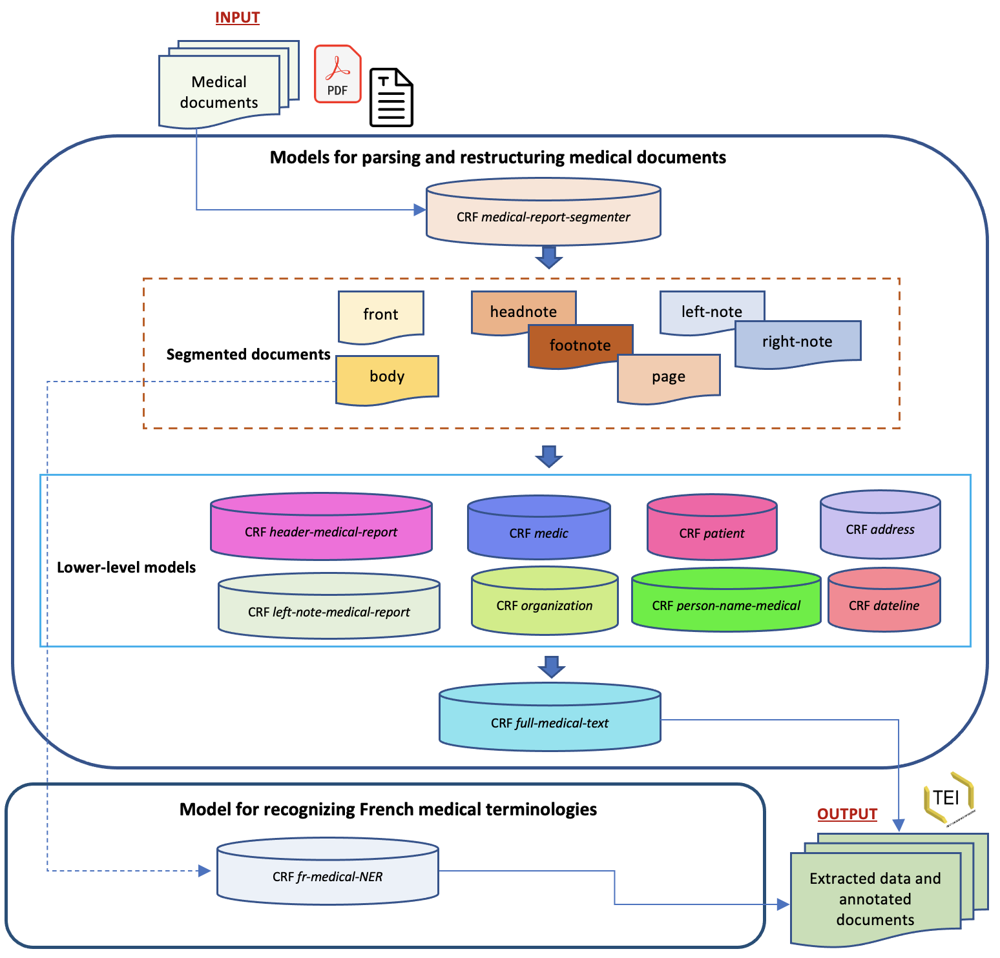

<h1>Training and evaluating grobid-medical-report models</h1>

## Models

As in Grobid, __grobid-medical-report__ also uses different sequence labeling models. For more complex extraction and parsing tasks, it uses several models in cascade.



The models prepared are:

- [x] medical-report-segmenter

- [x] header-medical-report

- [x] left-note-medical-report

- [x] full-medical-text

- [x] French medical NER 

- [ ] organization-medical-report

- [ ] medic

- [ ] patient

- [ ] name-medic

- [ ] name-patient

- [ ] dateline

Note:
- [x] (A completed model)
- [ ] (An uncompleted model - work in progress)

The models are placed under `grobid/grobid-home/models`. Each of these models can be re-trained using additional training data. For production, a model is trained with all available training data to maximize performance. For development purposes, it is possible to evaluate a model with part of the training data.

## Train and evaluate

For the __grobid-medical-report__ models, the training data is located under `grobid/grobid-medical-report/resources/dataset/*MODEL*/corpus/` where *MODEL* is the name of the model (e.g., `grobid/grobid-medical-report/resources/dataset/medical-report-segmenter/corpus`).

TEI files can be divided (e.g., 80%-20%) into training and evaluation datasets in the following ways: 

- manually: we choose and put the annotated datasets in two folders separately.
  
    The training data is present under `grobid/grobid-trainer/resources/dataset/*MODEL*/corpus/` while the evaluation data is present under  `grobid/grobid-trainer/resources/dataset/*MODEL*/evaluation/`.


- automatically: we put the the datasets under `grobid/grobid-trainer/resources/dataset/*MODEL*/corpus` and let grobid-medical-report choose and split them randomly as a given ratio (e.g., 0.8 for 80%). The first part of the data is the training data, while the second is the evaluation data.

Regardless of the method chosen (i.e., manual or automatic), the built model is placed under `grobid/grobid-home/models/*MODEL*/model.wapiti`. The newly built model will automatically replace the previous one. It is possible to rollback the process by replacing the current generated model with the backup record (`<model name>.wapiti.old`).

### Train
The considered training dataset is under `grobid/grobid-medical-report/resources/dataset/*MODEL*/corpus`.
To train and to generate a new model, under the project directory `grobid/grobid-medical-report` run the following command:

```bash
> ./gradlew <training-goal-name>
```
Training goal names are: `train_medical_report_segmenter`, `train_header_medical_report`, `train_left_note_medical_report`, `train_full_medical_text`.

An example of a command for training the __medical-report-segmenter__ model:
```bash
> ./gradlew train_medical_report_segmenter
```

An example of a command for training the __header-medical-report__ model: 
```bash
> ./gradlew train_header_medical_report
```

An example of a command for training the __left-note-medical-report__ model: 
```bash
> ./gradlew train_left_note_medical_report
```

An example of a command for training the __train_full_medical_text__ model:
```bash
> ./gradlew train_full_medical_text
```

An example of a command for training the __french_medical_ner__ model:
```bash
> ./gradlew train_french_medical_ner
```

As explain in [GROBID](https://grobid.readthedocs.io/en/latest/Training-the-models-of-Grobid/#train-and-evaluation-separately), we can control the training process (e.g., process speed) by using different parameters. To speed up the process, we can increase the `grobid.nb_thread` in the file `grobid-home/config/grobid.properties`. Further, to increase the speed, we can also modify the stopping criteria. For more information, please refer [this comment](https://github.com/kermitt2/grobid/issues/336#issuecomment-412516422).

### Evaluate
The considered evaluation dataset is under `grobid/grobid-trainer/resources/dataset/*MODEL*/evaluation`
To evaluate the model, under the project directory `grobid/grobid-medical-report/` execute the following command:
```bash
> ./gradlew <evaluation-goal-name>
```

Evaluation goal names are: `eval_medical_report_segmenter`, `eval_header_medical_report`, `eval_left_note_medical_report`, `eval_full_medical_text`.

#### Automatically split data, train and evaluate
To split (e.g., training:evaluation = 80:20) automatically and randomly the dataset under `resources/dataset/*MODEL*/corpus/` into training and evaluation datasets, execute the following command:

```bash
> ./gradlew <automatic-evaluation-goal-name>
```

Automatic evaluation goal names are: `eval_medical_report_segmenter_split`, `eval_header_medical_report_split`, `eval_left_note_medical_report_split`, `eval_full_medical_text`.

By default, the training and evaluation data partition is 80:20 (i.e., the datasets are under `grobid/grobid-trainer/resources/dataset/*MODEL*/corpus`). To change it, add the `-s` parameter or change the `-s` `build.gradle` to the desired proportion.

## Generation of training data

For each input Pdf file, __grobid-medical-report__ generates XML files according to the models adopted since each model uses different training data (e.g., *.training.medical.tei.xml, *.training.header.medical.tei.xml, *.training.left.note.medical.tei.xml). To use these automatically-generated XML files as a gold standard,  we need first to check and correct them.

When the models use PDF layout features, __grobid-medical-report__ generates additional feature files (e.g., *.training.medical, *.training.header.medical, *.training.left.note.medical).

To generate a new training data, under the project directory `grobid/grobid-medical-report/` execute the following command:

```bash
> java -Xmx4G -jar build/libs/grobid-medical-report-0.0.1-onejar.jar -gH grobid-home -dIn ~/path_to_input_directory/ -dOut ~/path_to_output_directory -exe <generation-of-training-data-command>
```

Generation of training data commands are: `createTrainingSegmentation`, `createTrainingHeader`, `createTrainingLeftNote`, `createMedicalNerTraining`.

An example of a command for generating a new training data for the __medical-report-segmenter__ model: 
```bash
> java -Xmx4G -jar build/libs/grobid-medical-report-0.0.1-onejar.jar -gH grobid-home -dIn ~/path_to_input_directory/ -dOut ~/path_to_output_directory -exe createTrainingSegmentation
```

An example of a command for generating a new training data for the __header-medical-report__ model: 
```bash
> java -Xmx4G -jar build/libs/grobid-medical-report-0.0.1-onejar.jar -gH grobid-home -dIn ~/path_to_input_directory/ -dOut ~/path_to_output_directory -exe createTrainingHeader
```

An example of a command for generating a new training data for the __left-note-medical-report__ model:
```bash
> java -Xmx4G -jar build/libs/grobid-medical-report-0.0.1-onejar.jar -gH grobid-home -dIn ~/path_to_input_directory/ -dOut ~/path_to_output_directory -exe createTrainingLeftNote
```

An example of a command for generating a new training data for the __full-medical-text__ model:
```bash
> java -Xmx4G -jar build/libs/grobid-medical-report-0.0.1-onejar.jar -gH grobid-home -dIn ~/path_to_input_directory/ -dOut ~/path_to_output_directory -exe createTrainingFullMedicalText
```

An example of a command for generating a new training data for the __fr-medical-NER__ model:
```bash
> java -Xmx4G -jar build/libs/grobid-medical-report-0.0.1-onejar.jar -gH grobid-home -dIn ~/path_to_input_directory/ -dOut ~/path_to_output_directory -exe createMedicalNerTraining
```

<!---Note for developers:

To create new blank training data (files containing the features and the text without any label), we need to uncomment createBlankTrainingFromPDF method in batch processing for each model. For example:
- uncomment createBlankTrainingFromPDF method in the createTrainingMedicalSegmentationBatch in MedicalReportParser class;
OR 
- uncomment createBlankTrainingFromPDF method in the createTrainingMedicalHeaderBatch in HeaderMedicalParser class 
etc...

--->

## Training guidelines

Annotation guidelines for creating the training data corresponding to the different GROBID models are available from the [following page](training/General-principles.md).
